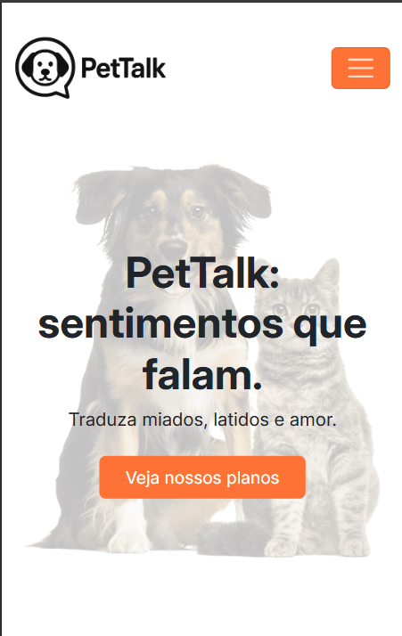
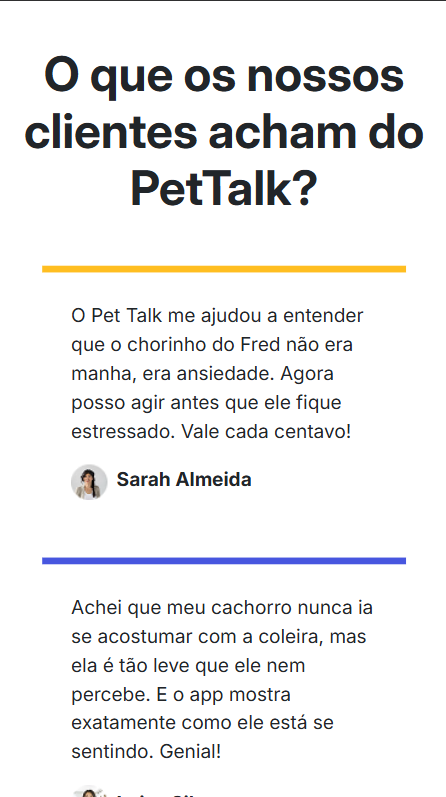
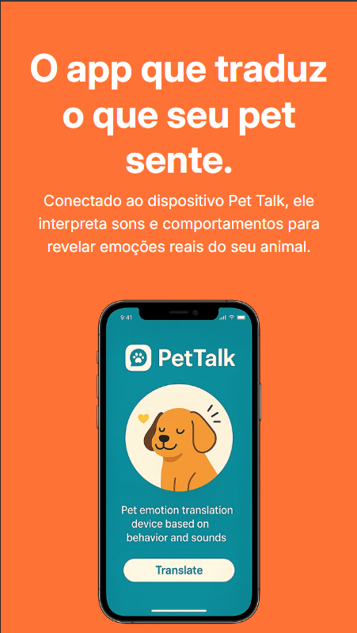
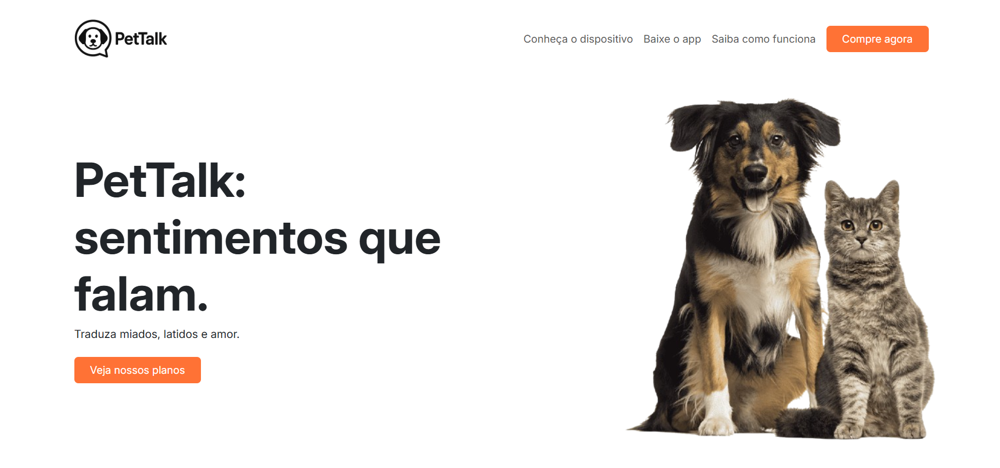
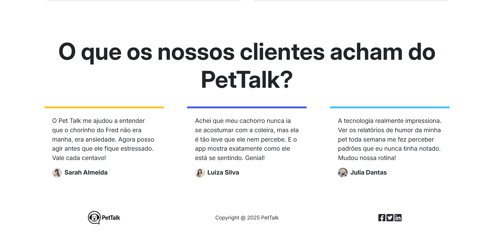

# 🐾 PetTalk - Dispositivo Tradutor de Sentimentos para Pets

Projeto desenvolvido como parte de um desafio de processo seletivo. O objetivo é criar um **layout responsivo, mobile first**, utilizando apenas **HTML, CSS e Bootstrap**, sem frameworks JavaScript ou bibliotecas externas.

## 📱 Sobre o Projeto

O **PetTalk** é um conceito de dispositivo que traduz os sentimentos dos pets com base em sons e comportamentos. Ele se conecta a um aplicativo, permitindo que tutores compreendam melhor o que seus animais de estimação estão sentindo.

Este layout apresenta visualmente o produto, sua proposta e os benefícios de forma clara, moderna e adaptável a diferentes dispositivos.

## 🎯 Requisitos Atendidos

- ✅ 100% HTML, CSS e Bootstrap
- ✅ Layout responsivo com abordagem **Mobile First**
- ✅ Apresentação clara da proposta do PetTalk
- ✅ Compatível com dispositivos móveis e desktops

## 🖼️ Screenshots

### Versão Mobile

### Versão Desktop

## 🧱 Tecnologias Utilizadas

- HTML5
- CSS3
- Bootstrap 5
